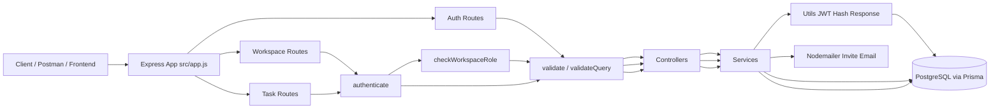
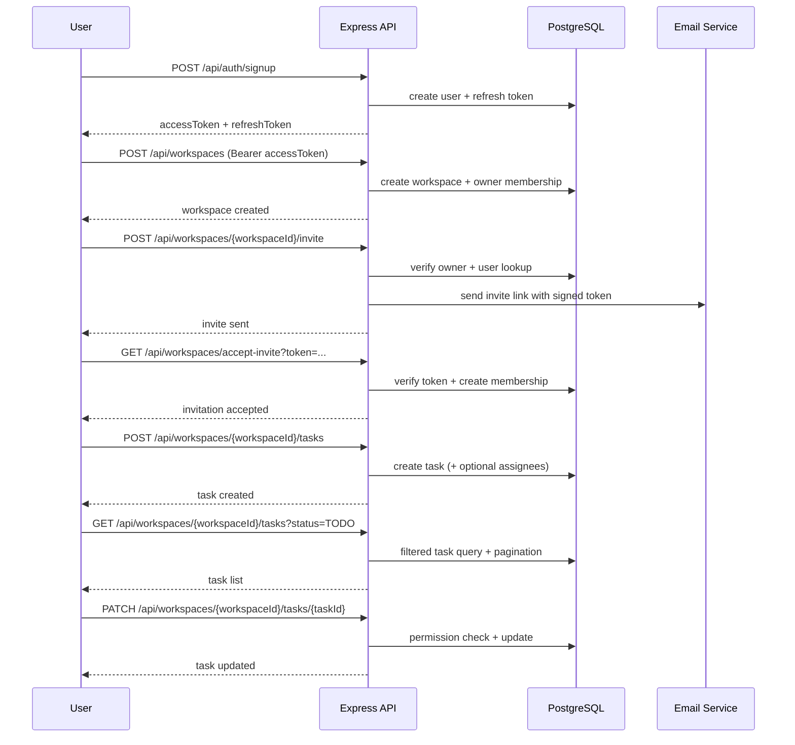

# Backend Flow Guide (A to Z)

This document explains your backend from start to finish by following the actual code in this project.

It is designed to help you understand:
- How a request enters the app and where it goes
- How authentication works (access + refresh tokens)
- How workspace features work (membership, roles, invite flow)
- How task features work (CRUD, filters, assignees)
- Which APIs exist right now and when to use each one

---

## 1. Tech Stack and Core Pattern

Your backend follows a layered architecture:
- Route layer: receives HTTP requests and applies middleware
- Controller layer: reads validated input and calls services
- Service layer: business logic + Prisma queries
- Utility layer: JWT, hashing, response helpers

Main stack:
- Express
- Prisma + PostgreSQL
- Zod for validation
- JWT for auth
- bcrypt for password hashing
- Nodemailer for workspace invite emails

---

## 2. Entry Point and Boot Flow

### 2.1 Server startup
- File: src/server.js
- Loads environment config
- Connects to DB using Prisma
- Starts Express app on configured port

Startup sequence:
1. Load env values via src/config/env.js
2. Validate required env keys:
   - DATABASE_URL
   - ACCESS_TOKEN_SECRET
   - REFRESH_TOKEN_SECRET
3. Create Prisma client from src/config/db.js
4. Connect to PostgreSQL
5. Start Express listener

### 2.2 App wiring
- File: src/app.js

Express mounts:
- GET /health
- GET /openapi.json
- GET /api-docs (Swagger UI page)
- /api/auth -> auth routes
- /api/workspaces -> workspace routes
- /api/workspaces/:workspaceId/tasks -> task routes

Then global handlers:
- notFound middleware
- globalErrorHandler middleware

---

## 3. Request Lifecycle (Generic)

Every feature mostly follows this lifecycle:
1. Route matches incoming path
2. Optional auth middleware verifies Bearer token
3. Optional RBAC/membership check runs
4. Validation middleware parses request using Zod
5. Controller calls service with clean data
6. Service executes business logic and Prisma operations
7. Controller returns standardized response via sendSuccess
8. Errors bubble to global error middleware and return sendError

Standard success format:
- success: true
- message: string
- data: (optional)

Standard error format:
- success: false
- message: string
- errors: (optional)

Validation errors from Zod return status 422.

---

## 4. Authentication Flow (Complete)

### 4.1 Signup
Route:
- POST /api/auth/signup

Flow:
1. validate(signupSchema) checks name/email/password rules
2. Controller forwards to authService.signup
3. Service checks if email already exists
4. Password is hashed with bcrypt
5. User is created in DB
6. Access token + refresh token are generated
7. Refresh token is persisted in refresh_tokens table
8. API returns user profile + both tokens

### 4.2 Login
Route:
- POST /api/auth/login

Flow:
1. validate(loginSchema)
2. Find user by email
3. Compare password with bcrypt
4. Generate fresh access + refresh tokens
5. Persist refresh token in DB
6. Return user + tokens

Security detail:
- If user not found, code does dummy password compare to reduce timing attacks.

### 4.3 Access protected routes
Middleware:
- authenticate in src/middlewares/auth.middleware.js

Flow:
1. Read Authorization header
2. Require format: Bearer <token>
3. Verify access token signature
4. Attach decoded payload to req.user
5. Continue to controller

Decoded payload includes:
- sub (user id)
- email

### 4.4 Refresh access token
Route:
- POST /api/auth/refresh

Flow:
1. validate(refreshTokenSchema)
2. Verify JWT signature of refresh token
3. Ensure same token exists in DB
4. Ensure DB expiry is not passed
5. Create new access token only
6. Return new access token

### 4.5 Logout
Route:
- POST /api/auth/logout

Flow:
1. validate(logoutSchema)
2. Find refresh token in DB
3. Delete token record
4. Return success

Effect:
- That refresh token can no longer mint new access tokens.

---

## 5. Workspace Domain Flow

## 5.1 Workspace and membership model
When a workspace is created:
- A row is inserted in workspaces
- Creator is inserted into workspace_members with role OWNER

Roles used:
- OWNER
- MEMBER

Soft delete behavior:
- Workspace delete sets deletedAt
- "active" workspace means deletedAt is null

### 5.2 Public invite-accept route
Route:
- GET /api/workspaces/accept-invite?token=...

Important:
- It is intentionally defined before auth middleware in workspace routes.

Flow:
1. Read token from query
2. Verify signed invitation token
3. Check workspace still exists and is active
4. If already member: return idempotent success message
5. Else create workspace membership with MEMBER role

### 5.3 Authenticated workspace routes
After router.use(authenticate), all workspace endpoints require access token.

#### Create workspace
- POST /api/workspaces
- Any authenticated user

#### Get my workspaces
- GET /api/workspaces
- Returns workspaces where user has membership
- Filters out soft-deleted workspaces

#### Get workspace details
- GET /api/workspaces/:workspaceId
- Requires membership
- Returns workspace + caller role + members list

#### Update workspace
- PATCH /api/workspaces/:workspaceId
- Requires OWNER via checkWorkspaceRole(["OWNER"])

#### Delete workspace (soft)
- DELETE /api/workspaces/:workspaceId
- Requires OWNER

### 5.4 Member management flow
All are OWNER-only by route middleware:
- POST /api/workspaces/:workspaceId/invite
- POST /api/workspaces/:workspaceId/members
- DELETE /api/workspaces/:workspaceId/members
- PATCH /api/workspaces/:workspaceId/members/:userId/role

Rules implemented in service:
- Cannot remove self as owner
- Cannot remove another owner
- Cannot change own role
- Cannot change role of another owner
- Cannot add same member twice
- Invite flow sends signed email link using Nodemailer

Invite token details:
- Signed with INVITE_TOKEN_SECRET or ACCESS_TOKEN_SECRET fallback
- Expires in 7 days
- Contains workspaceId, inviteeId, email

---

## 6. Task Domain Flow

Task routes are mounted under workspace scope:
- /api/workspaces/:workspaceId/tasks

Router is created with mergeParams: true, so task routes can read parent workspaceId.

All task routes require authenticate middleware.

### 6.1 Task access baseline
Common rule in service:
- User must be a workspace member (requireWorkspaceMember)

### 6.2 Create task
Route:
- POST /api/workspaces/:workspaceId/tasks

Flow:
1. Validate body with createTaskSchema
2. Ensure caller is workspace member
3. Validate assigneeIds (if provided) are workspace members
4. Create task in transaction
5. Optional bulk create task_assignees
6. Return task with createdBy and assignees

Defaults:
- status defaults to TODO
- priority defaults to MEDIUM

### 6.3 List tasks
Route:
- GET /api/workspaces/:workspaceId/tasks

Query filters:
- status
- priority
- assigneeId
- search (title contains)
- cursor (cursor pagination)
- limit (1..100, default 20)
- sortBy (dueDate | priority | createdAt)
- sortOrder (asc | desc)

Response includes:
- tasks array
- pagination: hasNextPage, nextCursor, limit

### 6.4 Get task by ID
Route:
- GET /api/workspaces/:workspaceId/tasks/:taskId

Rules:
- Caller must be workspace member
- Task must exist, belong to workspace, and not be soft-deleted

### 6.5 Update task
Route:
- PATCH /api/workspaces/:workspaceId/tasks/:taskId

Rules:
- Caller must be workspace member
- Only OWNER or task creator can update
- Body must include at least one updatable field

### 6.6 Delete task (soft)
Route:
- DELETE /api/workspaces/:workspaceId/tasks/:taskId

Rules:
- Caller must be workspace member
- Only OWNER or task creator can delete
- Soft delete by setting deletedAt

### 6.7 Assign user
Route:
- POST /api/workspaces/:workspaceId/tasks/:taskId/assignees

Rules:
- Caller must be OWNER
- Task must exist in workspace
- Target user must be workspace member
- Cannot assign duplicate assignee

### 6.8 Remove assignee
Route:
- DELETE /api/workspaces/:workspaceId/tasks/:taskId/assignees

Rules:
- Caller must be OWNER
- Task must exist in workspace
- Target must currently be assigned

---

## 7. API Catalog (All Endpoints So Far)

## 7.1 System
- GET /health
- GET /openapi.json
- GET /api-docs

### 7.2 Auth APIs
- POST /api/auth/signup
- POST /api/auth/login
- POST /api/auth/refresh
- POST /api/auth/logout

### 7.3 Workspace APIs
Public:
- GET /api/workspaces/accept-invite?token=...

Protected:
- POST /api/workspaces
- GET /api/workspaces
- GET /api/workspaces/:workspaceId
- PATCH /api/workspaces/:workspaceId
- DELETE /api/workspaces/:workspaceId
- POST /api/workspaces/:workspaceId/invite
- POST /api/workspaces/:workspaceId/members
- DELETE /api/workspaces/:workspaceId/members
- PATCH /api/workspaces/:workspaceId/members/:userId/role

### 7.4 Task APIs (all protected)
- POST /api/workspaces/:workspaceId/tasks
- GET /api/workspaces/:workspaceId/tasks
- GET /api/workspaces/:workspaceId/tasks/:taskId
- PATCH /api/workspaces/:workspaceId/tasks/:taskId
- DELETE /api/workspaces/:workspaceId/tasks/:taskId
- POST /api/workspaces/:workspaceId/tasks/:taskId/assignees
- DELETE /api/workspaces/:workspaceId/tasks/:taskId/assignees

---

## 8. Validation Rules (High-level)

Auth:
- Signup requires strong password policy
- Login requires email + password
- Refresh/logout require refreshToken

Workspace:
- create: name required (2..100), description optional <= 500
- update: at least one of name/description
- member ops: email or userId required depending on endpoint
- role change: role must be MEMBER or OWNER

Task:
- title required on create (1..255)
- description optional <= 5000
- status enum: TODO, IN_PROGRESS, IN_REVIEW, DONE
- priority enum: LOW, MEDIUM, HIGH, URGENT
- dueDate must be ISO datetime when provided
- update requires at least one field
- list query validates pagination/sort/filter fields

---

## 9. Error Handling Behavior

Centralized in src/middlewares/error.middleware.js:
- Handles custom errors with statusCode
- Maps Prisma unique constraint to 409
- Maps Prisma record missing to 404
- Maps JWT errors to 401
- Returns stack in development mode only

Zod validation errors return 422 from validate/validateQuery middleware.

---

## 10. End-to-End Diagram (Architecture + Flow)

### 10.1 Architecture Diagram

### 10.2 User Journey Sequence (Auth -> Workspace -> Task)

---

## 11. Practical Learning Path (How to understand quickly)

If you want to learn this codebase fast, follow this order:
1. src/app.js (route mounting and global pipeline)
2. src/routes/*.js (which middleware protects each endpoint)
3. src/controllers/*.js (input to service mapping)
4. src/services/*.js (real business rules)
5. src/validators/*.js (request contract)
6. src/middlewares/*.js (auth, role, validation, errors)
7. prisma/schema.prisma (actual data model)

---

## 12. Swagger / Testing Notes

You can test all APIs using:
- Swagger UI: /api-docs
- OpenAPI JSON: /openapi.json

For protected routes, always send:
- Authorization: Bearer <accessToken>

Use refresh flow when access token expires:
1. POST /api/auth/refresh with refreshToken
2. Replace access token in Authorization header

---

## 13. Final Mental Model

Think of your system as:
- Auth creates identity and session tokens
- Workspace defines collaboration boundary and roles
- Task exists inside one workspace and inherits workspace access rules
- OWNER role controls membership-sensitive actions
- Creator/OWNER controls task mutation actions
- Soft-delete keeps historical data while hiding active records

This is a solid foundation for adding comments, attachments, activity logs, and notifications next.
